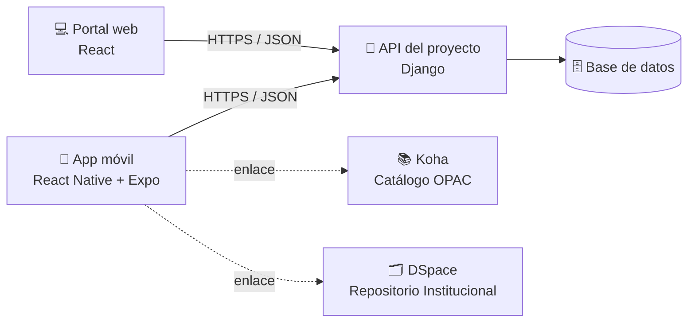

<div align="center">

# 📚 Biblioteca UPC · App móvil

**La biblioteca de la Universidad Popular del Cesar, en el bolsillo de toda la comunidad universitaria.**

<sub>Nombre definitivo de la app: por definir</sub>

<br/>


</div>

---

## 📖 Contenido

- [Sobre el proyecto](#-sobre-el-proyecto)
- [El problema](#-el-problema)
- [Nuestra propuesta](#-nuestra-propuesta)
- [¿Para quién es?](#-para-quién-es)
- [Funcionalidades](#-funcionalidades)
- [Planificación](#-planificación)
- [Arquitectura](#️-arquitectura)
- [Stack tecnológico](#️-stack-tecnológico)
- [Cómo empezar](#-cómo-empezar)
- [Estructura del proyecto](#-estructura-del-proyecto)
- [Cómo trabajamos](#-cómo-trabajamos)
- [Equipo](#-equipo)

---

## 🎯 Sobre el proyecto

Este repositorio contiene la **aplicación móvil** del proyecto de aula de la asignatura **Sistemas de Información** (Ingeniería de Sistemas, 7.º semestre) de la **Universidad Popular del Cesar (UPC)**, en Valledupar, Colombia.

El proyecto general, **Sistema de Gestión de Servicios de Biblioteca Unicesar**, construye un portal de servicios para la Biblioteca de la UPC inspirado en el modelo **CRAI** (Centro de Recursos para el Aprendizaje y la Investigación). Lo desarrollan cinco equipos: Backend, Frontend, Análisis de datos, Diccionario de datos y **Móvil**, que es el que trabaja en este repositorio.

> [!NOTE]
> Este proyecto es un **primer paso hacia el modelo CRAI**, no un CRAI completo. Su objetivo es reunir y modernizar los servicios que hoy presta la biblioteca para que esa transición sea posible.

---

## 🧩 El problema

La Biblioteca de la UPC presta mucho más que libros: asesorías en normas APA y en el gestor bibliográfico Mendeley, capacitaciones, reserva de salas, préstamo de tablets, depósito de trabajos de grado y actividades culturales como el cineclub. Pero la Dirección de la Biblioteca identificó cuatro problemas:

| | Problema | Consecuencia |
|---|---|---|
| 🧭 | **Información dispersa** | Los servicios están repartidos en distintas partes del portal institucional y el usuario debe buscarlos uno por uno. |
| 👀 | **Servicios poco conocidos** | Muchos estudiantes y docentes no saben que existen; hoy se dan a conocer solo en las charlas de inducción. |
| 📝 | **Solicitudes a mano, sin estadísticas** | El seguimiento es manual, así que la biblioteca no sabe con certeza quién usa qué servicio. |
| 📶 | **Internet inestable en los talleres** | En los talleres prácticos la conexión se cae o se pone lenta. |

---

## 💡 Nuestra propuesta

Una app para **Android e iPhone** que reúne los servicios de la biblioteca y los complementa con lo que solo un celular puede hacer bien.

La app **no reemplaza** a las plataformas que ya funcionan: **Koha** sigue siendo el catálogo y los préstamos, y **DSpace** sigue siendo el Repositorio Institucional. La app las enlaza y se conecta a la misma API que usa el portal web, así que ambos muestran siempre la misma información.

### ¿Por qué una app si el portal web ya es responsive?

Porque la app hace tres cosas que una página web no puede hacer bien:

1. 🔔 **Avisa aunque esté cerrada**: notificaciones y recordatorios.
2. 📷 **Usa el teléfono a fondo**: cámara para códigos QR y calendario del sistema.
3. 📴 **Funciona sin internet**: guías y material guardados en el dispositivo.

---

## 👥 ¿Para quién es?

Para **toda la comunidad universitaria**, con tres niveles de acceso:

| Nivel | Quiénes | Qué pueden hacer |
|---|---|---|
| 🌐 **Sin cuenta** | Visitantes, invitados y egresados | Ver servicios y horarios, buscar en el catálogo, consultar recursos académicos, ver la disponibilidad de salas y leer las guías. |
| 🎓 **Con cuenta institucional** | Estudiantes, docentes y administrativos | Todo lo anterior, más solicitar capacitaciones, agendar asesorías, reservar espacios, pedir tablets, seguir sus solicitudes y registrar asistencia. |
| 🛠️ **Personal de la biblioteca** | Administración y facilitadores | Bandeja de solicitudes, panel del día, agenda de asesorías y entrega de tablets. |

---

## ✨ Funcionalidades

Cada funcionalidad se rastrea con su requerimiento (RF), caso de uso (CU) e historia de usuario (HU). En este proyecto la relación es uno a uno: **RF-14 ↔ CU-14 ↔ HU-14**. La columna *Iteración* indica en qué iteración del proyecto se construye.

### 🎓 Vista de usuario

| Funcionalidad | RF / HU | Iteración |
|---|---|:---:|
| Servicios de la biblioteca con descripción, público y horarios | 01 | 1 |
| Acceso al catálogo bibliográfico (Koha / OPAC) | 02 | 1 |
| Bases de datos y recursos académicos | 03 | 1 |
| Inicio de sesión institucional y perfil | 05, 06 | 1 |
| Disponibilidad de espacios (vista semanal y mensual) | 17 | 2 |
| Solicitud de reserva de espacios | 18 | 2 |
| Asesorías: agendar, cancelar y reprogramar | 14 | 3 |
| Disponibilidad y solicitud de tablets | 22 | 3 |
| Mis solicitudes: estado e historial en un solo lugar | 08 | 4 |
| Solicitud de capacitaciones | 10 | 4 |
| Orientación para el depósito del trabajo de grado | 11 | 4 |

### 🛠️ Vista del personal

| Funcionalidad | RF / HU | Iteración |
|---|---|:---:|
| Bandeja de reservas: aprobar, modificar o rechazar | 19 | 2 |
| Agenda del facilitador y resultado de cada cita | 15 | 3 |
| Registro de entrega y devolución de tablets | 23 | 3 |
| Bandeja de solicitudes de formación | 12 | 4 |
| Panel del día: trámites, ocupación, tablets y asesorías | 26 | 4 |

### 🔁 Transversales

| Funcionalidad | RF / HU | Iteración |
|---|---|:---:|
| Vistas según el rol del usuario | 07 | 1 |
| Notificaciones: el backend envía el correo y la app suma notificaciones push | 27 | 2 |

La configuración de fondo (contenidos, líneas de formación, jornadas de asesoría, catálogo de espacios, bloqueos, inventario de tablets y parámetros generales) se gestiona desde el portal web.

### ⭐ Funciones plus

Aprobadas por la Dirección de la Biblioteca. Son el valor diferencial de la app frente al portal web.

| Función | Problema que resuelve | Qué gana la biblioteca |
|---|---|---|
| 📷 **Registro de asistencia con QR** | La biblioteca sabe quién pidió un servicio, pero no quién asistió. | Estadísticas de uso real sin trabajo manual, y liberación de salas reservadas que nadie ocupa. |
| 📴 **Guías y material sin internet** | El internet falla en los talleres prácticos. | Guías de APA, Mendeley, depósito de tesis y material de taller disponibles sin conexión. |
| 📅 **Citas en el calendario con recordatorios** | Las citas olvidadas dejan franjas perdidas. | Cada asesoría, reserva o capacitación queda en el calendario del celular y se actualiza si cambia. |

> [!IMPORTANT]
> Las funciones plus **no forman parte** de las 28 HU ni de los 103 SP del backlog general. Se estimarán como historias de usuario adicionales del equipo Móvil.

---

## 📅 Planificación

El proyecto general se planifica con **4 iteraciones de 8 días** (Planning Game), del **5 de octubre al 5 de noviembre de 2026**, para un total de **28 historias de usuario y 103 Story Points**. El equipo Móvil sigue el mismo calendario.

### Iteraciones

| # | Iteración | Fechas | HU | Velocidad | En la app |
|:---:|---|---|---|:---:|---|
| 1 | Portal, autenticación y configuración base | 5 – 12 oct | 01, 02, 03, 04, 05, 06, 07, 28 | 26 SP | Inicio, catálogo, recursos, inicio de sesión, perfil y vistas por rol |
| 2 | Espacios, reservas y notificaciones | 13 – 20 oct | 16, 17, 18, 19, 20, 27 | 26 SP | Disponibilidad y reserva de espacios, bandeja de reservas, notificaciones |
| 3 | Asesorías y préstamo de tablets | 21 – 28 oct | 13, 14, 15, 21, 22, 23, 24 | 26 SP | Agendar asesorías, agenda del facilitador, solicitud y entrega de tablets |
| 4 | Capacitaciones, seguimiento, estadísticas y Release 1.0 | 29 oct – 5 nov | 08, 09, 10, 11, 12, 25, 26 | 25 SP | Mis solicitudes, capacitaciones, autoarchivo, bandeja de formación y panel del día |
| | **Total** | **32 días** | **28 HU** | **103 SP** | **Release 1.0: 5 de noviembre de 2026** |

### Estimación

Los Story Points usan la escala de Fibonacci, con **1 SP ≈ 2 horas** de trabajo. Los SP del backlog cubren Backend y Frontend web.

| SP | Horas | Referencia |
|:---:|---|---|
| 1 | ≈ 2 h (≤ 3 h) | Enlace o redirección simple |
| 2 | ≈ 4 h (3,5 – 5 h) | Vista informativa o CRUD en el admin de Django |
| 3 | ≈ 6 h (5,5 – 8 h) | CRUD con validaciones o vista con varios casos |
| 5 | ≈ 10 h (9 – 13 h) | Flujo con estados, calendario o integración externa |
| 8 | ≈ 16 h (14 – 21 h) | Lógica compleja (generación de franjas recurrentes) |

<details>
<summary><b>📋 Backlog completo: 28 historias de usuario</b></summary>

<br/>

Prioridad: 1 = alta, 2 = media, 3 = baja. La columna *En la app* indica dónde aparece cada HU en este repositorio.

| HU | Historia | SP | Prioridad | Iteración | En la app |
|---|---|:---:|:---:|:---:|---|
| HU-01 | Consultar servicios del portal | 5 | 1 | 1 | 🎓 Usuario |
| HU-02 | Acceder al catálogo OPAC | 1 | 1 | 1 | 🎓 Usuario |
| HU-03 | Acceder a recursos académicos | 2 | 2 | 1 | 🎓 Usuario |
| HU-04 | Gestionar contenidos del portal | 5 | 1 | 1 | 💻 Solo web |
| HU-05 | Iniciar sesión institucional | 5 | 1 | 1 | 🎓 Usuario |
| HU-06 | Gestionar perfil de usuario | 2 | 2 | 1 | 🎓 Usuario |
| HU-07 | Asignar roles y permisos | 3 | 1 | 1 | 🔁 Transversal |
| HU-08 | Consultar estado de solicitudes | 5 | 2 | 4 | 🎓 Usuario |
| HU-09 | Gestionar líneas de formación | 2 | 2 | 4 | 💻 Solo web |
| HU-10 | Solicitar capacitación | 3 | 1 | 4 | 🎓 Usuario |
| HU-11 | Consultar orientación de autoarchivo | 2 | 2 | 4 | 🎓 Usuario |
| HU-12 | Gestionar solicitudes de formación | 5 | 1 | 4 | 🛠️ Personal |
| HU-13 | Configurar asesorías y jornadas | 8 | 1 | 3 | 💻 Solo web |
| HU-14 | Agendar / cancelar asesoría | 5 | 1 | 3 | 🎓 Usuario |
| HU-15 | Consultar agenda del facilitador | 3 | 2 | 3 | 🛠️ Personal |
| HU-16 | Gestionar espacios | 3 | 1 | 2 | 💻 Solo web |
| HU-17 | Consultar disponibilidad de espacios | 5 | 1 | 2 | 🎓 Usuario |
| HU-18 | Solicitar reserva de espacio | 5 | 1 | 2 | 🎓 Usuario |
| HU-19 | Gestionar reservas | 5 | 1 | 2 | 🛠️ Personal |
| HU-20 | Bloquear espacios | 3 | 2 | 2 | 💻 Solo web |
| HU-21 | Gestionar inventario de tablets | 2 | 1 | 3 | 💻 Solo web |
| HU-22 | Solicitar préstamo de tablet | 3 | 1 | 3 | 🎓 Usuario |
| HU-23 | Registrar entrega y devolución | 3 | 1 | 3 | 🛠️ Personal |
| HU-24 | Controlar préstamos vencidos | 2 | 2 | 3 | ⚙️ Backend |
| HU-25 | Registrar información estadística | 3 | 2 | 4 | ⚙️ Backend |
| HU-26 | Consultar y exportar estadísticas | 5 | 3 | 4 | 🛠️ Personal (panel del día) |
| HU-27 | Enviar notificaciones y recordatorios | 5 | 2 | 2 | 🔁 Transversal |
| HU-28 | Configurar parámetros generales | 3 | 1 | 1 | 💻 Solo web |
| | **Total** | **103** | | | |

**En la app:** 12 HU de usuario, 5 del personal y 2 transversales. Las 9 restantes se resuelven en el portal web o en el backend.

</details>

---

## 🏗️ Arquitectura



- La app **no tiene base de datos propia**: consume la API del equipo de Backend.
- Las pantallas **no llaman directamente al backend**: toda llamada pasa por `src/api`.
- Koha y DSpace se **enlazan**, no se duplican.

---

## 🛠️ Stack tecnológico

| Pieza | Para qué |
|---|---|
| [Expo](https://expo.dev) SDK 56 (React Native 0.85, React 19.2) | Base del proyecto: un solo código para Android e iOS |
| [Expo Router](https://docs.expo.dev/router/introduction/) | Navegación basada en archivos |
| [React Native Paper](https://callstack.github.io/react-native-paper/) | Componentes visuales con los colores de la UPC |
| [Zustand](https://zustand.docs.pmnd.rs/) | Estado global (sesión del usuario) |
| [TanStack Query](https://tanstack.com/query) | Consumo de la API: carga, errores y caché |
| [React Hook Form](https://react-hook-form.com/) + [Zod](https://zod.dev/) | Formularios con validación antes de enviar |
| [react-native-calendars](https://github.com/wix/react-native-calendars) | Vistas semanales y mensuales de disponibilidad (HU-14, HU-17) |
| expo-secure-store | Sesión guardada de forma cifrada |
| expo-notifications | Notificaciones push y recordatorios (HU-27) |
| expo-camera | Escaneo de códigos QR *(función plus)* |
| expo-calendar | Sincronización con el calendario del celular *(función plus)* |
| expo-file-system | Guías y material sin conexión *(función plus)* |

---

## 🚀 Cómo empezar

> [!IMPORTANT]
> Esta sección se completa cuando se inicialice el proyecto de Expo.

### Requisitos

- [Node.js](https://nodejs.org/) LTS (versión 22 o superior)
- [Git](https://git-scm.com/)
- La app **Expo Go** en tu celular, o un emulador de Android o iOS

### Instalación

```bash
# 1. Clonar el repositorio
git clone https://github.com/<usuario>/biblioteca-upc-movil.git
cd biblioteca-upc-movil

# 2. Instalar dependencias
npm install

# 3. Configurar variables de entorno
cp .env.example .env   # y completar la URL de la API

# 4. Iniciar el servidor de desarrollo
npx expo start
```

Escanea el código QR que aparece en la terminal con Expo Go (Android) o con la cámara (iPhone).

---

## 📂 Estructura del proyecto

```
biblioteca-upc-movil/
├── app/                 # Pantallas y rutas (Expo Router)
├── src/
│   ├── api/             # Llamadas al backend (única puerta de salida)
│   ├── components/      # Componentes reutilizables
│   ├── theme/           # Colores, tipografía y espaciado de la UPC
│   ├── store/           # Estado global (Zustand)
│   ├── hooks/           # Hooks personalizados
│   └── utils/           # Utilidades
├── assets/              # Imágenes, íconos y fuentes
└── docs/                # Documentación del proyecto (RF, CU, HU y plan de iteraciones)
```

> La estructura detallada se documenta al configurar el entorno de trabajo.

---

## 🤝 Cómo trabajamos

**Ramas**

- **`main`**: versión estable. Solo recibe cambios por Pull Request al cierre de cada iteración.
- **`develop`**: integración del trabajo del equipo durante la iteración.
- **`feature/hu<número>-<descripcion>`**: una rama por historia de usuario, por ejemplo `feature/hu14-agendar-asesoria`.

**Revisión y commits**

Cada Pull Request necesita al menos **una revisión** de otro integrante y debe nombrar la HU que resuelve. Los mensajes de commit siguen [Conventional Commits](https://www.conventionalcommits.org/es/v1.0.0/): `feat:`, `fix:`, `docs:`, `style:`, `refactor:`.

**Ceremonias**

| Ceremonia | Cuándo | Duración |
|---|---|---|
| Planning | Inicio de cada iteración | 1 h |
| Daily | Cada día | 15 min |
| Review / Demo | Cierre de cada iteración | 2 h |
| Retrospectiva | Cierre de cada iteración | 2 h |

---

## 👨‍💻 Equipo

| Integrante | Rol | GitHub |
|---|---|---|
| María García | Líder del equipo Móvil · Frontend móvil | [@Marysa2006](https://github.com/Marysa2006) |
| Jhon Gómez | Frontend móvil | [@JhonJ-G](https://github.com/JhonJ-G) |
| Jorge León | Backend / integración móvil | [@PokerProgramming](https://github.com/PokerProgramming) |
| Rigoberto Márquez | Backend / integración móvil | [@RigoMarquez](https://github.com/RigoMarquez) |

---

## 🙏 Agradecimientos

A la **Dirección de la Biblioteca de la Universidad Popular del Cesar**, por abrirnos las puertas y compartir las necesidades reales de la biblioteca, y al docente de la asignatura **Sistemas de Información**.

---

<div align="center">

**Universidad Popular del Cesar** · Valledupar, Colombia · 2026

<sub>Proyecto académico. Licencia por definir con el docente.</sub>

</div>
